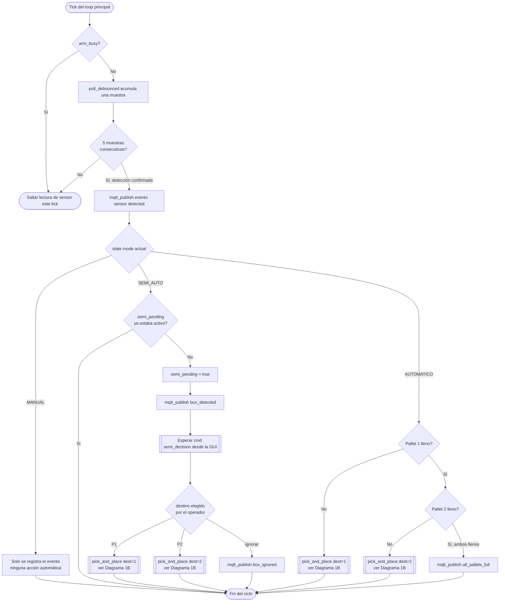
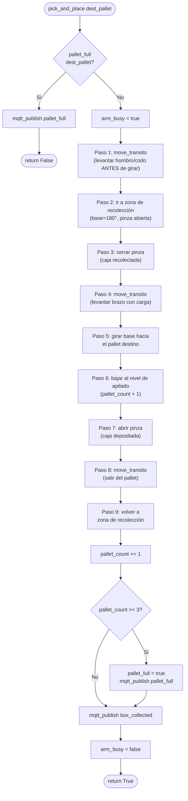
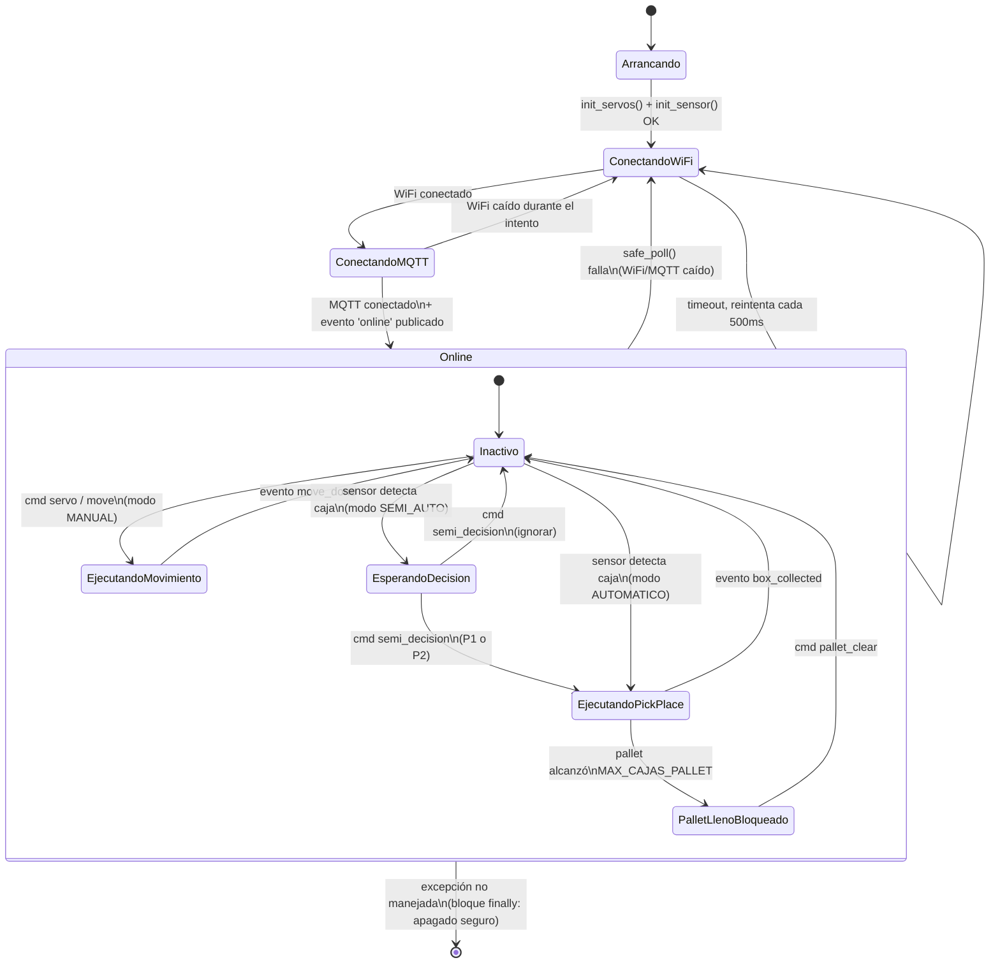
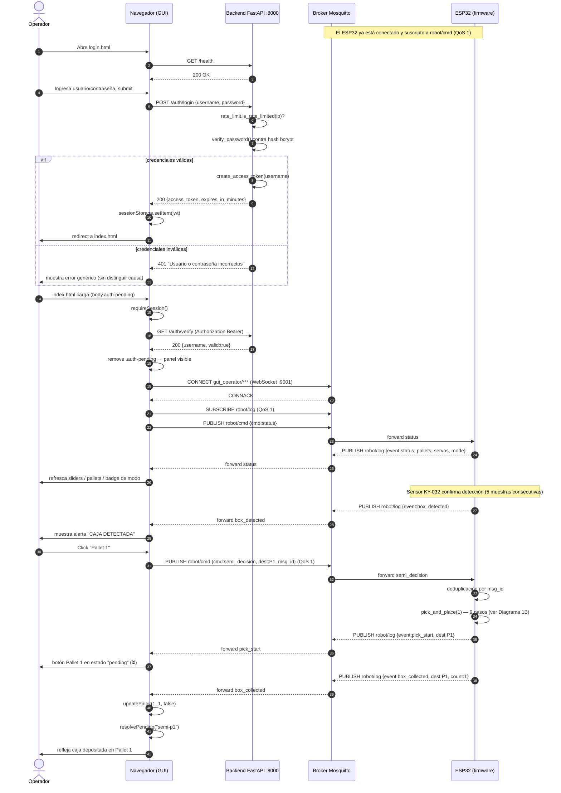
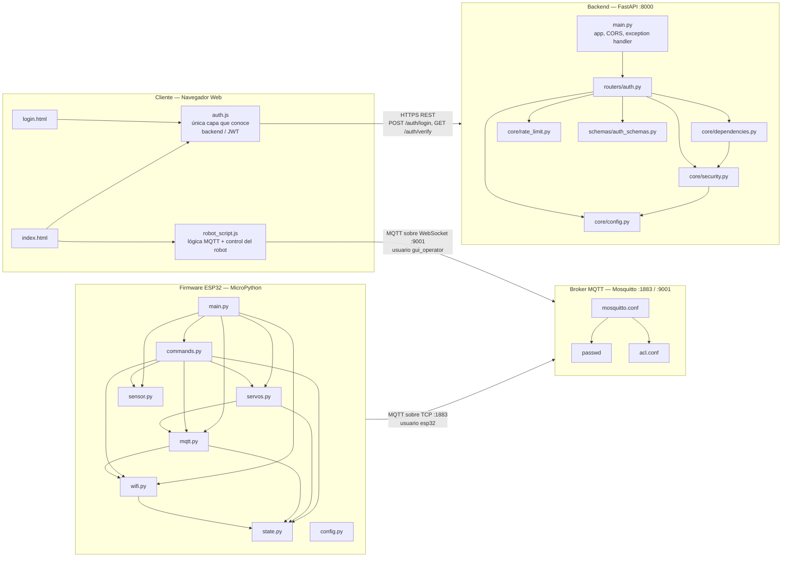
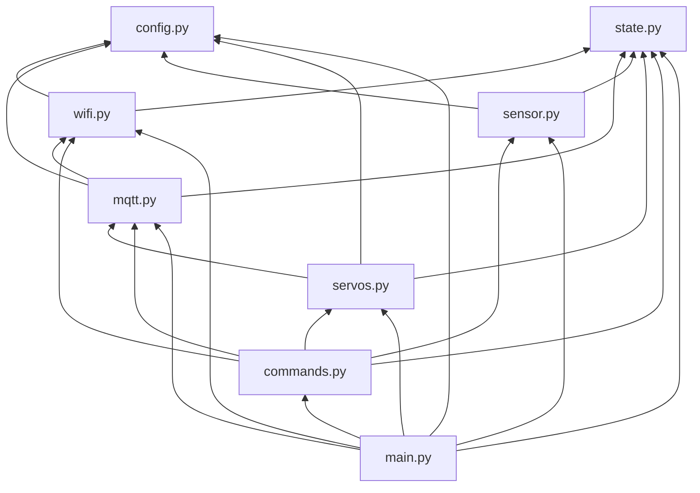
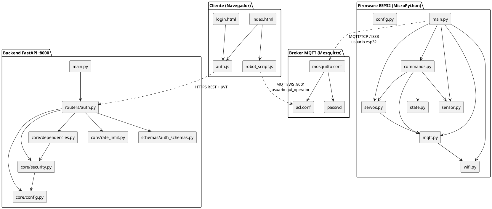
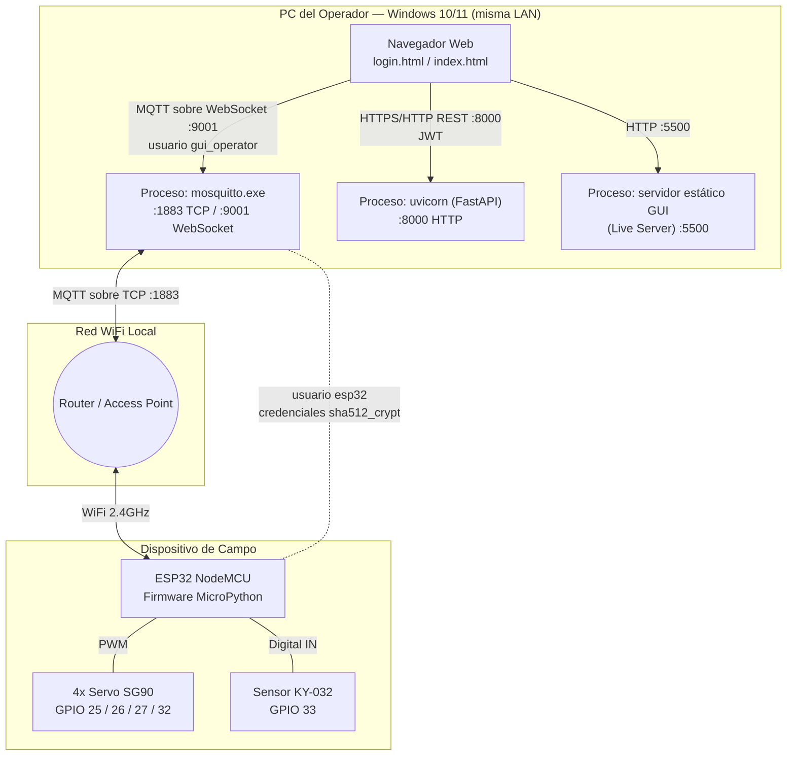
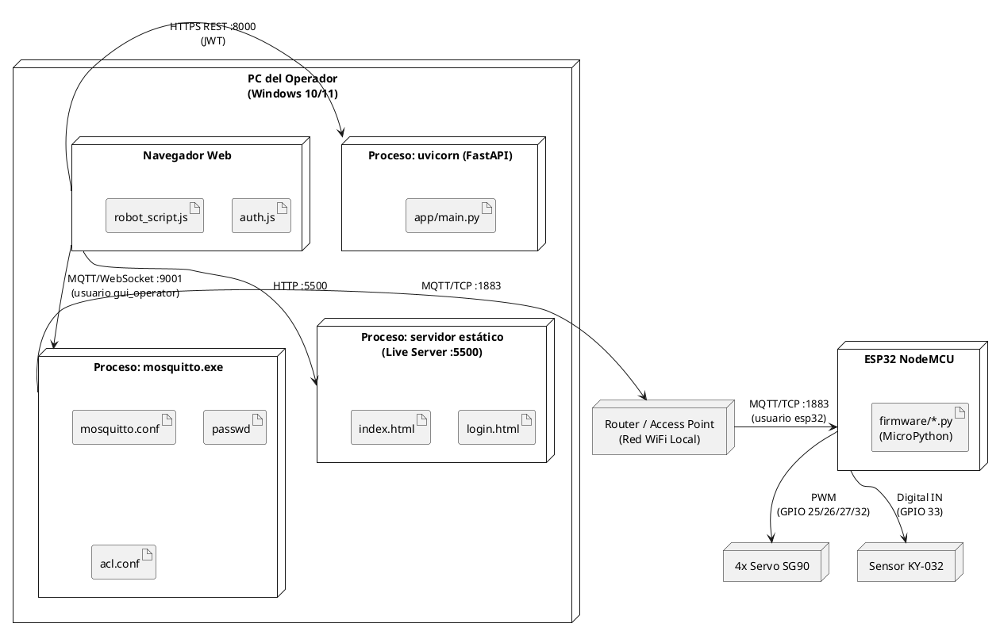

# Diagramas Técnicos — Sistema Pick & Place (IC2)

> Proyecto: Brazo Robótico Pick & Place — Ingeniería en Computación II (UNRAF)
> Autor: Francisco Bevilacqua.

## Índice

1. [Diagrama de Flujo](#1-diagrama-de-flujo-flowchart) — lógica de decisión de sensor/modos + secuencia interna de `pick_and_place`
2. [Diagrama de Máquina de Estados](#2-diagrama-de-máquina-de-estados) — ciclo de vida operativo del firmware
3. [Diagrama de Secuencia](#3-diagrama-de-secuencia) — interacción completa Operador → GUI → Backend → Broker → ESP32
4. [Diagrama de Dependencias de Módulos](#4-diagrama-de-dependencias-de-módulos-component-diagram) — macro (sistema completo) y micro (firmware)
5. [Diagrama de Despliegue y Red](#5-diagrama-de-despliegue-y-red-deployment-diagram) — nodos físicos, procesos y protocolos

---

## 1. Diagrama de Flujo (Flowchart)

### Por qué estos dos flujos y no otros

Un flowchart documenta **un algoritmo paso a paso**, con sus puntos de decisión —
es la herramienta correcta para explicar *cómo* piensa el sistema ante un evento,
no *qué estados* atraviesa (eso es la máquina de estados, diagrama 2) ni *quién le
habla a quién* (eso es la secuencia, diagrama 3). Elegí el algoritmo más denso en
decisiones de negocio de todo el proyecto: **la lógica de `process_sensor_event()`**
(`firmware/commands.py`), porque es donde convergen los tres modos de operación
(MANUAL / SEMI_AUTO / AUTOMÁTICO) y las reglas de seguridad (`arm_busy`,
`pallet_full`). Se separó en dos diagramas para que cada uno quepa en una sola
captura de pantalla legible:

- **1A** — decisión de alto nivel: desde que el sensor confirma una detección hasta
  que se decide *si* y *hacia dónde* se dispara un `pick_and_place`.
- **1B** — el detalle interno de `pick_and_place(dest_pallet)` (`firmware/servos.py`):
  los 9 pasos mecánicos de la secuencia de recolección y depósito.

### 1A — Decisión de sensor y modos de operación

**Decisiones que este diagrama justifica visualmente:**
- El guard `arm_busy` corta el flujo *antes* de leer el sensor — evita procesar una
  nueva detección mientras el brazo todavía resuelve la anterior (condición de
  carrera evitada por diseño, no por casualidad).
- El debounce de 5 muestras (`TIMING["sensor_debounce"]`) es una decisión de
  robustez de hardware (filtra ruido eléctrico), documentada en `sensor.py`.
- El modo MANUAL comparte el mismo camino de detección que los otros dos modos
  (telemetría siempre se publica), pero **deliberadamente no dispara ninguna
  acción automática** — el operador mantiene control total.
- AUTOMÁTICO prioriza Pallet 1 sobre Pallet 2 de forma determinística (regla de
  negocio explícita, no arbitraria).

### 1B — Secuencia interna de `pick_and_place(dest_pallet)`

**Por qué el "tránsito seguro" aparece 3 veces (pasos 1, 4 y 8):** no es
redundancia — cada tránsito ocurre en un momento mecánico distinto (antes de ir a
recolectar, después de agarrar la caja, y al salir del pallet), y cada uno previene
un accidente físico específico: tumbar una caja ya colocada en el pallet al girar
la base con el brazo bajo. Este es exactamente el tipo de decisión de diseño que
conviene señalar en la defensa como evidencia de que la secuencia no se escribió
"a prueba y error", sino con un análisis de riesgo mecánico explícito.

---

## 2. Diagrama de Máquina de Estados

### Por qué esta máquina y no una por "modo"

En vez de modelar tres máquinas de estado separadas (una por modo de operación),
se modela **una sola máquina compuesta**: un nivel superior de **conectividad**
(arrancando → conectando → online) y, dentro del estado `Online`, un nivel de
**operación** (inactivo / ejecutando movimiento / esperando decisión / bloqueado
por pallet lleno). Esto refleja fielmente cómo está implementado el firmware: la
lógica de negocio (`commands.py`) solo tiene sentido *dentro* de una sesión MQTT
activa, y el propio `main.py` reconecta automáticamente si esa condición deja de
cumplirse — modelarlo como un único diagrama jerárquico (estados compuestos UML)
es más preciso que tres diagramas planos desconectados entre sí.

**Puntos defendibles de este diagrama:**
- `EjecutandoMovimiento` y `EjecutandoPickPlace` son estados **mutuamente
  excluyentes** con `Inactivo` — el guard `arm_busy` en el código es, ni más ni
  menos, la variable booleana que materializa "¿estoy en uno de estos dos estados
  o no?". El diagrama de estados y esa única variable de `state.py` son la misma
  información en dos representaciones distintas.
- `PalletLlenoBloqueado` es un estado explícito y no un simple `if` disperso en el
  código: el sistema queda ahí hasta un `pallet_clear` externo, sin ninguna
  transición de timeout — es una decisión de negocio (requiere confirmación humana
  de que el pallet fue vaciado físicamente, no se asume automáticamente).
- El estado `Online → ConectandoWiFi` demuestra la resiliencia ante cortes de red:
  no hay ningún estado terminal de "error" del que el sistema no pueda recuperarse
  solo, salvo el apagado explícito (`[*]` final, correspondiente al bloque
  `finally` de `main.py`).

---

## 3. Diagrama de Secuencia

### Por qué un único diagrama de punta a punta

En vez de partirlo en "secuencia de login" + "secuencia de operación MQTT" por
separado, se armó **un solo diagrama continuo** que atraviesa los cinco
participantes reales del sistema (Operador, Navegador/GUI, Backend, Broker,
ESP32). La razón: la pregunta más común en una defensa de este tipo de proyecto es
*"mostrame de punta a punta qué pasa desde que abro el navegador hasta que la caja
cae en el pallet"* — y ese recorrido cruza las dos capas de seguridad (JWT +
MQTT/ACL) documentadas en los README de `backend/`, `gui/` y `mosquitto-broker/`.
Partirlo en dos diagramas rompería esa narrativa continua.

**Detalles del protocolo que este diagrama hace explícitos:**
- El `alt/else` del login es la representación formal de la rama de éxito/fracaso
  descrita en `backend/README.md` (incluyendo la mitigación de timing attack: el
  camino de "credenciales inválidas" pasa igual por `verify_password()` con un
  hash *dummy*, aunque el diagrama simplifica ese detalle interno por legibilidad —
  se puede ampliar como nota si el docente pide el detalle exacto).
- El campo `msg_id` viaja en el mensaje 25/26 y se consume explícitamente en el
  mensaje 27 (`ESP->>ESP: deduplicación`) — la trazabilidad extremo a extremo de la
  garantía QoS 1 queda visible en una sola línea de tiempo.
- El `Note over ESP,MQ` inicial deja claro que el ESP32 no espera al operador para
  conectarse — es autónomo y ya está operativo antes de que exista sesión alguna en
  la GUI, coherente con que la GUI es un cliente más del broker, no un intermediario
  obligatorio para que el sistema funcione.

---

## 4. Diagrama de Dependencias de Módulos (Component Diagram)

### Por qué dos niveles (macro y micro)

Un componente único que mezclara "todo el sistema" con "cada archivo `.py` del
firmware" sería ilegible. Se separa en:

- **Macro**: los cuatro subsistemas del repositorio (`gui/`, `backend/`,
  `mosquitto-broker/`, `firmware/`) y cómo se conectan entre sí — para mostrar la
  arquitectura general del TP en una sola lámina.
- **Micro**: el grafo de dependencias interno del firmware modularizado — el punto
  más defendible del proyecto en términos de Ingeniería de Software (SRP aplicado
  a nivel de módulo, sin ciclos de import), documentado en detalle en
  `firmware/README.md`.

### 4A — Macro: componentes del sistema completo

### 4B — Micro: grafo de dependencias interno del firmware (sin ciclos)

**Cómo leer este grafo (dirección `BT`, de abajo hacia arriba):** las flechas
salen del módulo que **depende** hacia el módulo del que **depende** — por eso
`config.py` y `state.py` quedan abajo de todo (son hojas, no dependen de nadie) y
`main.py` arriba de todo (conoce a todos los demás). La ausencia de una flecha
`mqtt.py → commands.py` es la prueba visual de que **no hay ciclo de imports**:
`commands.py` sí depende de `mqtt.py`, pero `mqtt.py` recibe las funciones de
`commands.py` como parámetros (`connect_mqtt(on_message_cb, status_cb)`), nunca
las importa — la técnica de inyección de dependencias documentada en
`firmware/mqtt.py` y en `firmware/README.md` (sección 2.1).

### 4C — Alternativa en PlantUML (notación UML formal con `<<component>>`)

---

## 5. Diagrama de Despliegue y Red (Deployment Diagram)

### Por qué importa distinguir "componente" de "despliegue"

El diagrama 4 responde *"quién depende de quién en el código"*. Este diagrama 5
responde una pregunta distinta: *"qué proceso corre en qué máquina física, en qué
puerto, y con qué protocolo de red"*. Acá se ve, por ejemplo, que **todos los procesos de
software (broker, backend, servidor estático, navegador) corren en la misma PC**,
mientras que el ESP32 es el único nodo físicamente distinto, conectado por WiFi.

### 5A — Mermaid

### 5B — Alternativa en PlantUML (notación UML de despliegue: `node` / `artifact`)

**Puntos defendibles de este diagrama:**
- Los **cuatro procesos de software** (Mosquitto, uvicorn, servidor estático,
  navegador) corriendo en un único nodo físico (la PC) es una simplificación
  deliberada para una demo académica en LAN — en un despliegue de producción real
  cada uno podría vivir en una máquina/contenedor distinto, y el diagrama deja
  explícito ese punto de escalabilidad futura sin necesidad de implementarlo.
- El ESP32 es el **único nodo verdaderamente distribuido** del sistema — de ahí
  que sea también el único punto con seguridad de transporte reforzada por
  broker (usuario `esp32` con ACL de mínimo privilegio, ver
  `mosquitto-broker/README.md`).
- Los tres puertos distintos en la misma PC (`5500`, `8000`, `1883`/`9001`) están
  explícitos porque un desajuste de puerto es, en la práctica, el error más común
  al levantar la demo — este diagrama funciona también como checklist de arranque,
  coherente con `ARRANCAR_SISTEMA.ps1`.

---

## Resumen

| Pregunta... | Ver |
|---|---|
| "¿Cómo decide el robot qué hacer cuando detecta una caja?" | Diagrama 1A |
| "¿Cómo funciona mecánicamente el pick & place, paso a paso?" | Diagrama 1B |
| "¿Qué estados puede tener el sistema y cómo se recupera de una desconexión?" | Diagrama 2 |
| "Mostrar todo el flujo desde que abro el navegador hasta que se mueve el brazo" | Diagrama 3 |
| "¿Por qué modularizar el firmware así, y no hay riesgo de import circular?" | Diagrama 4B |
| "¿Cómo se relacionan los cuatro subsistemas del repositorio entre sí?" | Diagrama 4A |
| "¿Dónde corre cada cosa físicamente, y por qué puerto se comunica?" | Diagrama 5 |